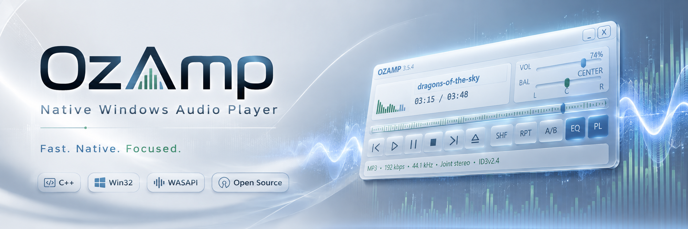
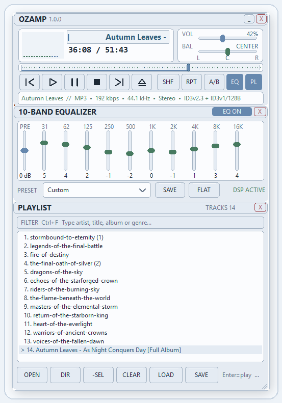

<p align="center">
  
</p>

<p align="center">
  <a href="https://github.com/lumbojev/OzAmp/releases/latest">
    
  </a>
  <a href="https://github.com/lumbojev/OzAmp/actions/workflows/build-windows.yml">
    
  </a>
  
  
</p>

<p align="center">
  <strong>OzAmp is a compact native Windows audio player created by Oskar Lumbojev.</strong><br>
  Fast local playback, a focused Win32 interface, persistent EQ, playlist workflow and audio-reactive visuals — without accounts, telemetry or unnecessary layers.
</p>

<p align="center">
  <a href="https://github.com/lumbojev/OzAmp/releases/latest"><strong>⬇ Download OzAmp for Windows x64</strong></a>
  &nbsp;•&nbsp;
  <a href="https://github.com/lumbojev/OzAmp/releases">Releases</a>
  &nbsp;•&nbsp;
  <a href="RELEASE_NOTES.md">Release notes</a>
  &nbsp;•&nbsp;
  <a href="docs/ARCHITECTURE.md">Architecture</a>
</p>

---

## Screenshot

<p align="center">
  
</p>

## Why OzAmp?

OzAmp started from a simple idea: **a local music player should feel immediate, focused and personal**.

It is deliberately built as a native Windows desktop application rather than a browser shell. The UI stays compact, playback remains local, and the core features are designed around everyday listening instead of accounts, cloud services or telemetry.

## Highlights

- **Native C++ / Win32** desktop application
- **WASAPI** audio output with selectable devices and fallback handling
- **Windows Media Foundation** decoding
- Dockable and resizable playlist with search/filter and multi-selection
- Play Next / ordered queue workflow
- **10-band equalizer** with persistent presets
- Session and window-position restore
- Hardware media keys and global hotkeys
- Local media library, album art and track information
- Fullscreen audio-reactive visualizer
- Compact shade mode
- `.ozskin` skin support
- No account requirement, telemetry or analytics

## Download

### Windows x64

The recommended way to install or update OzAmp is through the latest GitHub release:

**[Download the latest OzAmp release →](https://github.com/lumbojev/OzAmp/releases/latest)**

For v1.0.0 specifically:

**[Download OzAmp-1.0.0.exe](https://github.com/lumbojev/OzAmp/releases/download/v1.0.0/OzAmp-1.0.0.exe)**

> Windows may show a SmartScreen warning for an unsigned independent executable. Verify the SHA-256 checksum published with the release if desired.

## Platform

OzAmp 1.0.0 targets **64-bit Windows**. Windows 10 and Windows 11 are the intended desktop environments.

## Build from source

LLVM/Clang for Windows is required. From a Developer Command Prompt or terminal where `clang-cl` and `lld-link` are available:

```bat
build_windows_llvm.bat
```

Expected output:

```text
OzAmp-1.0.0.exe
```

A GitHub Actions workflow in `.github/workflows/build-windows.yml` performs the same Windows x64 build in CI.

## Repository layout

| Path | Purpose |
| --- | --- |
| `main.cpp` | Win32 application, UI, playlist, queue and persistence |
| `audio_engine.cpp/.h` | WASAPI / Media Foundation playback and PCM processing |
| `winlite.h` | Compact Windows ABI/header surface used by the project |
| `ozamp.ico` / `ozamp.res` | Application icon and compiled Windows resource |
| `skins/` | Bundled `.ozskin` themes |
| `docs/ARCHITECTURE.md` | High-level implementation overview |
| `TEST_CHECKLIST.md` | Release smoke-test checklist |

## Privacy

OzAmp is designed as a **local-first desktop application**. It does not require an account and is built without telemetry or analytics.

See [`SECURITY_AND_PRIVACY.md`](SECURITY_AND_PRIVACY.md) for details.

## Contributing

Bug reports and focused pull requests are welcome. Please read [`CONTRIBUTING.md`](CONTRIBUTING.md) before submitting code.

## License

OzAmp is released under the **MIT License**. See [`LICENSE`](LICENSE).

Copyright © 2026 Oskar Lumbojev.
